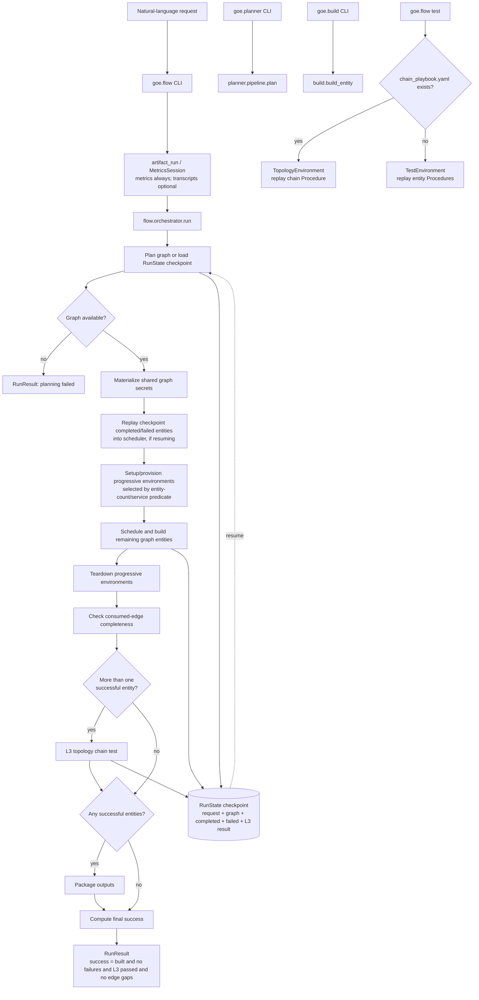
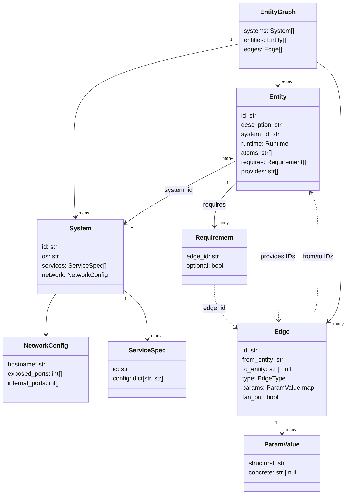
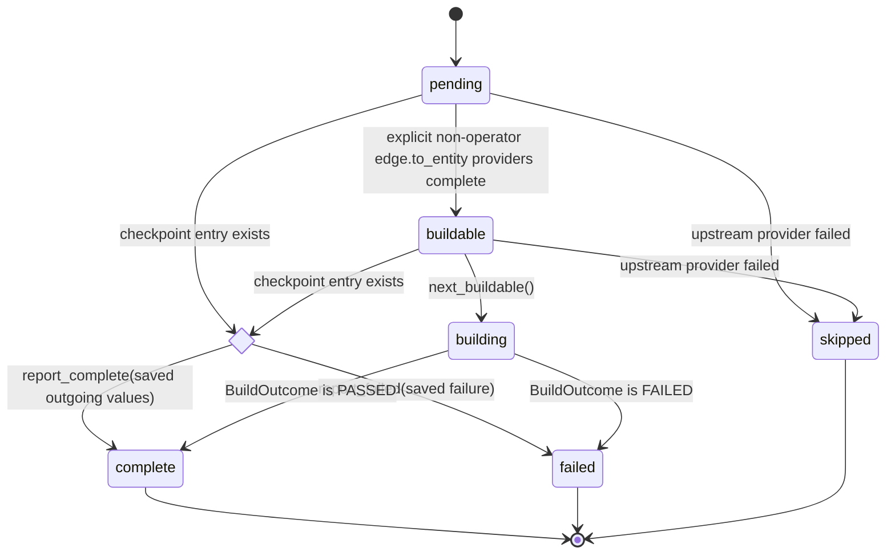
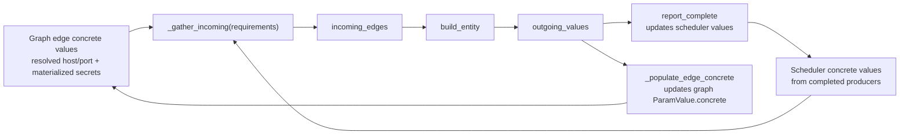
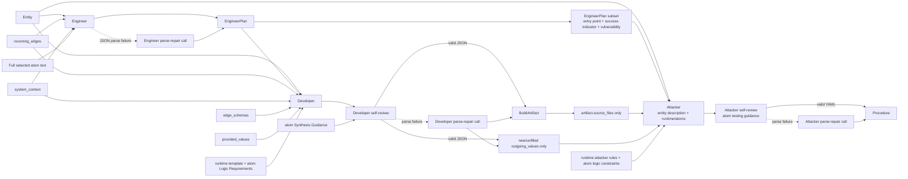
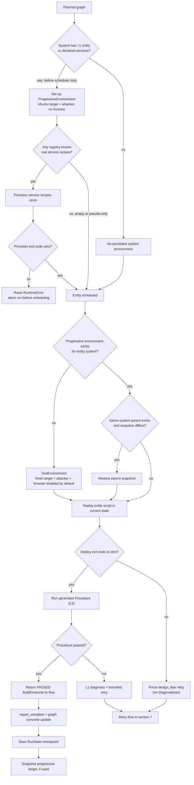
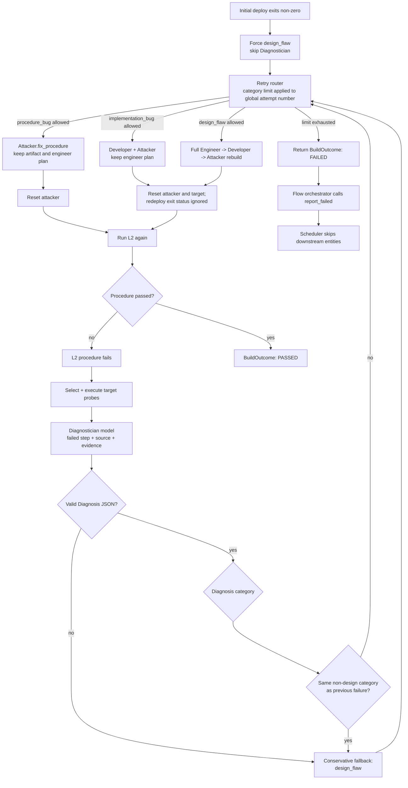
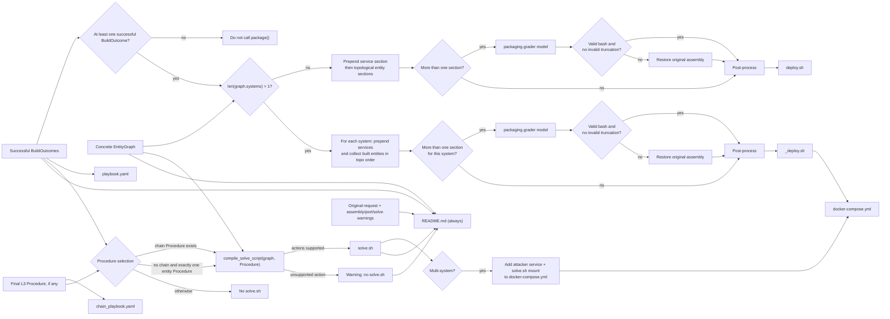
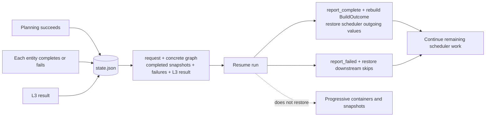
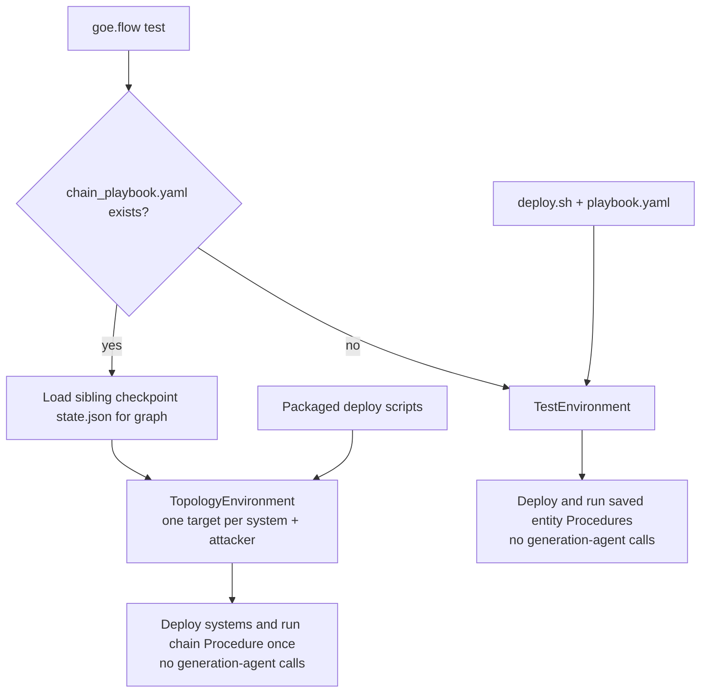

# GoE v2: Executable Architecture, Agent Context, and Test Gates

This document was derived by enumerating and tracing the code under `game_of_everything/goe/`. It describes v2 only. It does not use the legacy `src/game_of_everything/` implementation as an architectural source.

## 1. Runtime boundaries and entry points

The primary command is `python -m goe.flow run <request>`. The command handler always opens a metrics session; transcript and file capture are optional. It then calls `goe.flow.orchestrator.run`, the control plane for the complete run:

1. plan or restore an `EntityGraph`;
2. materialize graph-level secrets;
3. schedule and build entities;
4. run the L3 chain test if more than one entity built successfully;
5. package artifacts even when the final success gate is false.

The codebase also exposes narrower paths:

- `python -m goe.planner <request>`: planner only; emits an `EntityGraph`.
- `python -m goe.build --spec <entity.yaml>`: construction, deployment, and L2 test for a single entity; no graph scheduling or L3 chain test.
- `python -m goe.flow test <output-dir>`: replays packaged procedures without calling any generation agent.
- `goe.eval`: separately exercises planning, building, or full-flow evaluation suites; it is not in the production run path.



## 2. The information graph: design state versus run state

`EntityGraph` is the durable design artifact that crosses the planner/build/test/package boundaries. It has three node collections:

- `systems`: machine definitions. A system has an ID, OS, named services and their configuration, plus hostname and exposed/internal ports.
- `entities`: a vulnerable application or OS-level misconfiguration. An entity belongs to one system, has a runtime, vulnerability atoms, and names of capabilities it requires and provides.
- `edges`: directed capability handoffs. An edge has an ID, source entity (or `operator`), target entity (or `None`), an `EdgeType`, declared parameter names, and optional fan-out semantics.

An edge parameter preserves two levels of meaning:

```text
ParamValue {
  structural: string      # planner's semantic description / expected reference
  concrete: string | None # runtime-specific value, filled later
}
```

The planner owns structure: systems, entity IDs, edge IDs, edge type, and parameter keys. Builders can only supply concrete values for declared parameter keys. The developer output is explicitly validated against the provided edge schema before a value is allowed back into the graph.



The entity/edge associations are ID references rather than nested objects: `Requirement.edge_id` and `Entity.provides` refer to edge IDs, while `Edge.from_entity` and `Edge.to_entity` refer back to entity IDs. `operator` is a special source. A `None` target represents a terminal edge or, when `fan_out=true`, a capability consumed through matching requirements.

Supported edge types are `network_reach`, `shell_as`, `creds_for`, `db_session`, `file_read`, `file_write`, `code_exec`, and `token_for`. The graph validator has exact required parameter sets for each type; unknown or missing keys are validation failures.

The graph is a directed acyclic dependency model except for operator-originating access. It is subject to code-level checks for wired `provides`, requirement coverage, duplicate connections, edge type/parameter compatibility, reachability from `operator`, fan-out correctness, valid system references, no cycles, and at least one initial access point.

## 3. Planning: which model calls run and what each receives

The planner is a sequence of independent Bedrock calls. All use `GoEConfig.model_for("planner")`; there is no persistent planner-agent conversation. Each call receives the prior structured outputs that it needs.

```mermaid
sequenceDiagram
    participant U as User request
    participant P as planner.pipeline
    participant L as Bedrock planner model
    participant V as Code validator

    U->>P: request
    P->>L: design_systems(request)
    L-->>P: System[]
    P->>L: plan_killchain(request, System[])
    L-->>P: ordered killchain text
    loop Outer: up to 2 entity-plan attempts
        P->>L: plan_entities(request, System[], killchain, atom catalogs)
        L-->>P: EntityStub[]
        P->>L: grade_stubs(System[], EntityStub[], atom catalogs)
        L-->>P: corrected EntityStub[]
        P->>L: specify_entities(request, System[], EntityStub[], atom catalogs, runtimes, edge types)
        L-->>P: Entity[]
        loop Inner: up to 3 edge attempts
            P->>L: connect_edges(Entity[], System[], prior inner-loop violations)
            L-->>P: Edge[]
            P->>P: resolve host and network port deterministically
            P->>V: validate(EntityGraph)
            V-->>P: valid or Violation[]
            alt graph is valid
                P-->>U: return validated EntityGraph immediately
            else graph is invalid
                V-->>P: violations feed next connect_edges attempt
            end
        end
        P->>P: inner exhaustion starts a new entity plan; violations reset
    end
    P-->>U: final violations after all attempts are exhausted
    Note over P,L: JSON stages make one repair call on parse failure; killchain is plain text
```

The planner calls, in execution order, are:

| Stage | Caller label | Input context | Output |
| --- | --- | --- | --- |
| System designer | `planner.design_systems` | Request | `System[]` |
| Killchain planner | `planner.plan_killchain` | Request + serialized systems | Ordered text attack sequence |
| Entity planner | `planner.plan_entities` | Request + systems + killchain + web/misconfiguration atom catalogs | `EntityStub[]` |
| Stub grader | `planner.grade_stubs` | Systems + stubs + atom catalogs | Corrected `EntityStub[]` |
| Entity specifier | `planner.specify_entities` | Request + systems + stubs + atom catalogs + supported runtimes + legal edge types | Full `Entity[]` |
| Edge connector | `planner.connect_edges` | Entities + systems + legal edge types + validation violations from prior edge attempt | `Edge[]` |

### `EntityStub`: the planning-only intermediate

`EntityStub` is the lightweight, planning-only description of a proposed vulnerability. The entity planner creates stubs after systems and the ordered killchain are known; the stub grader corrects or removes them before the entity specifier expands them into the graph's full `Entity` objects.

```text
EntityStub {
  id: str
  description: str
  system_id: str
  runtime: str = "ubuntu"
  atoms: list[str]
}
```

A stub answers: **what vulnerability should exist on which system?** It intentionally has no `requires` or `provides` fields. The full `Entity` adds those edge IDs, so it answers: **how does this vulnerability consume and hand off capabilities in the attack graph?**

`resolve(graph)` is not an agent. It fills a missing `host` from the target entity's system hostname and fills `network_reach.port` from the target system's exposed ports. The validator likewise makes no model call. These two deterministic passes make the graph more concrete before building begins.

## 4. Scheduling and value propagation

Before building, the flow calls `materialize_secrets(graph)`. Today this deterministically generates an SSH private key once for an applicable `creds_for` edge, base64-encodes it, and stores it in `edge.params.secret.concrete`; the matching credential type is also concrete. This prevents two separately deployed systems from generating incompatible key pairs.

`BuildScheduler` topologically orders non-operator edges, maintains one state per entity, and returns the next buildable entity. It is currently a sequential scheduler: despite the data model being a DAG, the orchestrator invokes one `build_entity` at a time.



Concrete capability values move alongside those states:



For an entity requirement, the scheduler builds this input shape:

```python
incoming_edges = {
    "edge_id": {
        "param": "concrete value",
    },
}
```

It first reads concrete values already present on the graph (resolved host/port and materialized secrets), then unconditionally overlays values emitted by the completed producer. Prefilled values stay authoritative because the Developer parser removes echoed prefilled parameters before they become `outgoing_values`, not because the scheduler protects them during its merge. Scheduler dependencies come from explicit non-operator edges with a non-null `to_entity`; they are not independently inferred from `Requirement.optional` or a targetless fan-out edge.

On success, the orchestrator both calls `scheduler.report_complete(entity_id, outgoing_values)` and mutates the corresponding declared graph parameters to set their `concrete` fields. This is the central information handoff from an entity build to a downstream entity and later L3 test. After all builds, a guard fails the overall run if any parameter of an edge consumed by a built entity is still unset; SSH-key secrets stored as mere file paths are also rejected.

## 5. Per-entity crew: agents, order, and exact handoffs

The construction crew is ordinary Python orchestration, not a framework-managed multi-agent crew. `construction_crew.orchestrator.build` runs these model-backed agents in strict order for every build attempt:



| Agent | Runs when | Receives | Produces | Built-in call pattern |
| --- | --- | --- | --- | --- |
| Engineer | Every fresh crew build | Serialized entity, incoming edges, system context, full selected atom text | `EngineerPlan` | Generate; parse retry only if JSON fails. |
| Developer | After Engineer | Entity, engineer plan, runtime spec, incoming edges, system context, edge schemas, prefilled provided values, atom logic constraints | `BuildArtifact`, `outgoing_values` | Generate, self-review, parse retry. |
| Attacker | After Developer | Entity description, engineer attack intent, generated source/setup content, outgoing values, runtime attack rules, atom testing guidance | Typed YAML `Procedure` | Generate, self-review, parse retry. |

The `EngineerPlan` contains a summary, runtime, endpoint/data design, vulnerability placement, attack entry point, success indicator, optional npm/pip package suggestions, and notes. `BuildArtifact` contains source files, primary source, deployment metadata, optional DB schema/seed, runtime/system dependencies, and app directory. A `Procedure` contains typed actions, assertions, optional browser sessions, step IDs, and output capture declarations.

The orchestrator computes four separate context products before invoking this crew:

| Context product | Constructed from | Delivered to | Engineering intent |
| --- | --- | --- | --- |
| `incoming_edges` | Graph concrete values plus upstream `outgoing_values` | Engineer, Developer | Reuse exact predecessor capabilities. |
| `edge_schemas` | Entity's declared requirements and provides in the graph | Developer | Permit values only for declared, unresolved edge parameters. |
| `provided_values` | Already concrete params on edges this entity provides | Developer | Embed host/port/generated secret verbatim; do not invent or re-emit it. |
| `system_context` | Entity's system, all sibling entities, and summaries from built same-system siblings | Engineer, Developer | Scope this build to one link and describe shared machine state. |

`system_context` is especially important for co-located entities. It names the platform-installed services, shows live same-system sibling facts parsed from their deploy scripts (app directory, created users, written paths, configured services), lists other entities that must not be re-created, and names the current entity's required/provided edges. It tells the agent to make its success observable on its own system because end-to-end verification belongs to L3.

The Developer's outgoing values are validated before acceptance: unknown edge IDs, non-map payloads, undeclared keys, and blank values are errors. Values that were prefilled by graph resolution or secret materialization are removed from agent output so the graph remains authoritative for them. Consequently, the per-entity Attacker sees only newly emitted outgoing values; authoritative prefilled host/port/secret values are not included in its `outgoing_values` input.

## 6. Deployment environments and the L2 entity test gate

`build.build_entity` turns the crew result into a deploy script, deploys it, then runs the Attacker's procedure. A web artifact is transformed into a bash script by `RuntimeRegistry`; it installs the selected runtime, writes source files, installs dependencies, initializes the database, starts the app with `nohup`, and performs a runtime healthcheck. Ubuntu entities use their generated setup script directly.

The selected test environment depends on system shape:



`TestEnvironment` is isolated per entity and delegates Docker lifecycle actions to the container tool. In orchestrated builds its browser sidecar is enabled by default. `ProgressiveEnvironment` provisions declared services once, accumulates deployments in a shared Ubuntu target, snapshots after every L2-passing entity, restores snapshots for retries/fan-out branches, and restarts services that do not survive a snapshot restore. Progressive selection is based only on entity count or declared services; the code does not enforce an all-Ubuntu runtime guard, and progressive mode has no browser/CDP support. That is a real implementation constraint for mixed/web systems and browser procedures.

Checkpoint resume reconstructs scheduler outcomes but does not recreate prior progressive containers or Docker snapshots. A resumed downstream same-system build can therefore request a parent snapshot that is not present. Fan-out restore also chooses only the first same-system parent returned by `_same_system_parent`; it does not merge multiple parent snapshots.

L2 testing runs after a successful initial deployment. On implementation/design repairs it also runs after redeployment even though that redeployment's exit status is discarded. Its execution context is:

```python
{
    "target_host": env.get_target_host(),
    "attacker_host": env.get_attacker_host(),
    "target_port": str(runtime_port) or "",
    "edges": incoming_edges,
}
```

The procedure runner adds `steps: {}` and then, for every step:

1. interpolates action strings;
2. executes one typed action in the attacker, target, HTTP client, listener, or browser;
3. evaluates the declared assertion;
4. captures selected action results into `steps.<step_id>.<output>`;
5. stops at the first failed assertion.

Interpolation supports `${target_host}`, `${attacker_host}`, `${target_port}`, `${edge.<id>.<param>}`, `${steps.<step>.<output>}`, and, in L3, `${system.<id>.host}` / `.port`. Browser sessions are created only when the procedure declares them.

## 7. Entity failure diagnosis and retry ownership

L2 failure invokes the Diagnostician, which is a separate model-backed agent with target-container inspection evidence. It receives failed procedure information, the generated source files, and the outputs of up to ten selected probes. Probe selection uses runtime, atoms, DB metadata, app path/port, failed step, source-file names, and dependencies. Examples include processes, listening ports, health endpoint, application logs, SQLite schema, SUID binaries, SSH configuration, and Samba configuration.



The retry router compares category limits against one global, one-based attempt number; the limits are not independent per-category budgets. Procedure and implementation repair allow attempts one and two, while redesign allows only attempt one. The build loop detects repeated identical non-design diagnoses and escalates them to `design_flaw`. A non-zero initial deployment exit is forced into `design_flaw` without asking the Diagnostician. If attempts are exhausted, `build_entity` returns failure and the flow orchestrator marks downstream dependents skipped. The repair path calls `env.deploy(...)` after an implementation/design rebuild, discards that redeployment command's exit status, and then runs L2.

## 8. L3: multi-entity chain test and its separate chain agent

L3 runs only when the build stage has more than one successful entity, regardless of whether the entities are on one or multiple systems. The test derives per-system deploy scripts by grouping successful entities in topological order, prepending deterministic service scripts, and invoking the same assembly pipeline used by packaging. The two paths call the model-backed conflict grader independently, so their resulting script bytes are not guaranteed to be identical.

```mermaid
sequenceDiagram
    participant O as Flow orchestrator
    participant C as chain_test
    participant T as TopologyEnvironment
    participant CA as Chain Attacker
    participant X as Procedure executor

    O->>C: graph with concrete edge values + successful BuildOutcomes
    C->>C: assemble per-system deploy scripts
    C->>T: create network, one target/system, one attacker
    C->>T: deploy each system script
    alt any initial system deployment fails
        C->>C: set FAILED result; no chain Procedure
    else all initial deployments succeed
        C->>T: non-gating HTTP healthchecks for exposed ports
        C->>CA: graph summary + every entity Procedure
        CA->>CA: generate then self-review
        opt reviewed YAML does not parse
            CA->>CA: one parse-repair call
        end
        alt chain YAML still invalid
            C->>C: set FAILED result; no chain Procedure
        else chain Procedure available
            CA-->>C: chain Procedure
            C->>X: execute with systems + all resolved edge values
            loop while failed and repair budget remains
                X-->>C: failed step and action results
                C->>T: gather attacker probes and identifiable target probes
                C->>C: summarize failure evidence
                C->>T: recreate target containers and redeploy<br/>retain network and attacker
                alt reset/redeploy fails
                    C->>C: set FAILED result and stop retries
                else reset succeeds
                    C->>CA: fix_chain(current Procedure, diagnosis)
                    opt repaired YAML does not parse
                        CA->>CA: one parse-repair call
                    end
                    CA-->>C: repaired Procedure or parse failure
                    C->>X: retry when repair parsed
                end
            end
            alt latest execution passed
                C->>C: set PASSED result
            else retries exhausted or repair failed
                C->>C: set FAILED result with optional final Procedure
            end
        end
    end
    C->>T: teardown in finally on every exit
    C-->>O: ChainTestResult + optional final Procedure
```

`TopologyEnvironment` makes one Ubuntu target container per graph system, assigns each target's graph hostname as a shared-network alias, and creates one attacker container. It has no browser sidecar. The chain agent is distinct from the per-entity Attacker. It receives:

- every system's hostname and port visibility;
- every entity's system, runtime, description, atoms, and required/provided edge IDs;
- every edge's structural and concrete values;
- every successful per-entity YAML procedure.

It generates one attacker-only procedure, then self-reviews it. Its required addressing is `${system.<id>.host}` and its edge transfer syntax is `${edge.<id>.<param>}` or captured step output.

The L3 static context is derived directly from the graph:

```python
{
    "target_host": env.get_target_host(),
    "attacker_host": env.get_attacker_host(),
    "target_port": "",
    "systems": {system_id: {"host": hostname, "port": first_exposed_port}},
    "edges": {edge_id: {param: concrete_or_structural_fallback}},
}
```

An unresolved parameter becomes its structural string as a logged fallback in L3 interpolation, but the flow's edge-completeness guard records it as a run failure. L3 retries up to four repairs. Each retry recreates the target-system containers and redeploys them while retaining the network and attacker container; it does not rerun the initial HTTP healthchecks. It then asks `chain_attacker.fix_chain` to change the existing procedure against summarized failure evidence. A failed L3 test makes `RunResult.success` false.

## 9. Assembly, packaging, replay, and persistence

Packaging is an assembly stage, not a replacement for testing. For every system, sections are concatenated in graph topological order. When there is more than one section, `packaging.grader` makes an additional model call using the developer model tier to resolve cross-section conflicts such as duplicate users, password overwrites, or destructive file overwrites. Invalid bash is rejected. A grader result shortened by more than 30% is treated as suspicious truncation only when its bash syntax is also invalid; rejected output is replaced by the original assembly.

### Package assembly



Package creation is gated only by `built` being non-empty. Entity failures, edge gaps, or an L3 failure can make the final run unsuccessful without preventing the successful subset from being packaged.

### Checkpoint and resume flow



Successful snapshots contain the deploy script, serialized per-entity procedure, outgoing values, and attempt count. Failure snapshots contain reason and category. The L3 checkpoint stores its result, not the generated chain procedure.

### Package replay flow



`RunState` is checkpointed as `output/.checkpoints/<run_id>/state.json` after planning and after each terminal entity outcome, then after L3. It persists the original request, full graph, completed snapshots (deploy script, serialized procedure, outgoing values, attempts), failures, and chain-test result. Resume restores completed entities into the scheduler before new work starts, which re-establishes concrete value propagation.

The package contains `deploy.sh` for a single-system case, or per-system scripts and `docker-compose.yml` for multi-system cases. It always includes `playbook.yaml`; it includes `chain_playbook.yaml` when L3 produced a chain procedure. The replay CLI deploys these outputs into fresh test containers and executes the saved procedure(s), making it the post-package test path without new model calls.

## 10. Completion conditions and model-call inventory

A run is successful only if at least one entity built, no entity failed, L3 passed when it ran, and no consumed edge parameter is incomplete. Packaging may still occur when those conditions are not met, so consumers should use `RunResult.success` rather than output-directory existence as the success signal.

The baseline model-call inventory for a successful fresh run is:

- Planner: six calls in the nominal path (system design, killchain, entity planning, stub grading, entity specification, edge connection), plus bounded parse/validation retries.
- Per entity: Engineer once; Developer generate plus self-review; Attacker generate plus self-review. JSON/YAML parse retries add calls.
- L2 failure only: Diagnostician once per failure, plus the selected targeted/full reconstruction calls.
- L3 only: Chain Attacker generate plus self-review; each chain failure can add a repair call.
- Multi-section deploy assembly only: script-grader calls. L3 assembly and final packaging invoke the grader independently, so a run can make both calls.

Every model invocation routes through `goe.bedrock.call`, which uses Bedrock Converse, applies bounded client timeouts/retries, and records caller/model/token/latency metrics when a `MetricsSession` is active. Artifact capture can also persist prompt/response transcripts and crew outputs, but that persistence is optional and does not alter the dataflow above.
